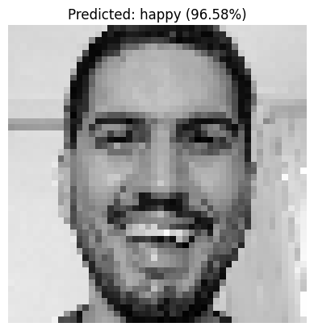
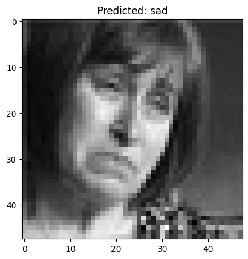
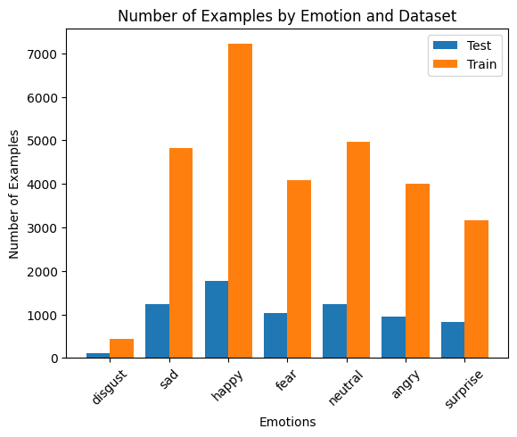

# FER2013-Facial Emotion Recognition

 
<br>
 

## About the Dataset
The FER2013 dataset contains grayscale images of faces, each with a dimension of 48x48 pixels. The images have been pre-processed to ensure that the faces are centered and occupy a consistent space across the dataset. The primary objective is to classify each image into one of seven emotional categories based on the facial expression portrayed. The categories are as follows:
- 0 = Angry
- 1 = Disgust
- 2 = Fear
- 3 = Happy
- 4 = Sad
- 5 = Surprise
- 6 = Neutral

The dataset is divided into a training set with 28,709 images and a public test set comprising 3,589 images.


<br>

## Models
In this project, I have explored the application of two different convolutional neural network architectures for the task of facial emotion recognition:

### Simple CNN
The first approach involved developing a straightforward Convolutional Neural Network (CNN) that includes several convolutional and pooling layers followed by dense layers for classification. This model serves as a baseline to evaluate the complexity and nuances of emotion recognition.

### ResNet
To leverage deeper and more complex structures, I also implemented a version of the Residual Network (ResNet). This model uses residual blocks with skip connections to enable training of deeper networks without the problem of vanishing gradients, aiming to improve the accuracy and robustness of the emotion classification.

## Installation
To set up this project, you will need to install Python and the necessary libraries such as TensorFlow, Keras, and NumPy. You can install these packages using pip:
```bash
pip install tensorflow keras numpy matplotlib
```
Run the notebook!
